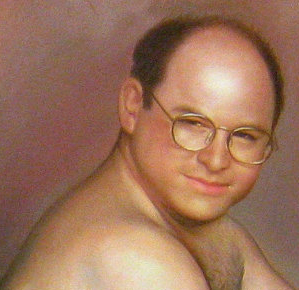

<div align="center">

  
    <h1><a href="https://github.com/ScottKirvan/KeyCast">ScottKirvan/KeyCast</a></h1>
  <h3>Nulla nobis dicta iste minus dolor repellendus aspernatur atque</h3>
  
<!-- Badges -->
<p>
  <a href="https://github.com/ScottKirvan/KeyCast/graphs/contributors">
    
  </a>
  <a href="">
    
  </a>
  <a href="https://github.com/ScottKirvan/KeyCast/network/members">
    
  </a>
  <a href="https://github.com/ScottKirvan/KeyCast/stargazers">
    
  </a>
  <a href="https://github.com/ScottKirvan/KeyCast/issues/">
    
  </a>
  <a href="https://github.com/ScottKirvan/KeyCast/blob/master/LICENSE.md">
    
  </a>
  <a href="https://discord.gg/gQH4mXWQRT">
    <!---->
    
  </a>
</p>
   
<h4>
    <a href="https://github.com/ScottKirvan/KeyCast/">View Demo</a>
  <span> · </span>
    <a href="https://github.com/ScottKirvan/KeyCast">Documentation</a>
  <span> · </span>
    <a href="https://github.com/ScottKirvan/KeyCast/issues/">Report Bug</a>
  <span> · </span>
    <a href="https://github.com/ScottKirvan/KeyCast/issues/">Request Feature</a>
  </h4>
</div>

**KeyCast** is voluptatibus magni nemo est. Nulla nobis dicta iste minus dolor repellendus aspernatur atque. Earum expedita aut inventore tempora fugiat deleniti. Molestias minima nam expedita beatae totam ipsa reprehenderit animi. Occaecati quibusdam beatae ducimus voluptate ut doloribus vitae amet. Quia ut ut voluptate dignissimos adipisci dolorum rem.

## build

```shell
msbuild /p:platform=win32 /p:Configuration=Release
```

Just run:  [keycastow.exe](keycastow.exe)  （on Windows）

## Credits
A huge thank you and all creds to [Brook Hong](https://brookhong.github.io/) and their original [KeyCastOW](https://github.com/brookhong/KeyCastOW)

Copyright (c) (2015): Brook Hong.  
Rubing Yang (2022).  
This code contains modifications by Scott Kirvan.  Modifications (c) (2023) Scott Kirvan  - All Rights Reserved   
*KeyCast is licensed under the [MIT License](LICENSE.md)*

Project Link: [KeyCast](https://github.com/ScottKirvan/KeyCast)   
[CHANGELOG](notes/CHANGELOG.md)  
[TODO](notes/TODO.md)  


